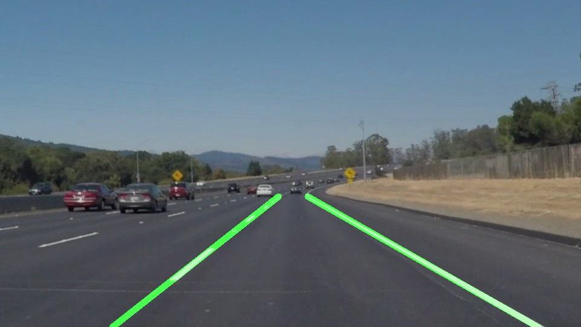

# **Finding Lane Lines on the Road** 

## Overview

When we drive, we use our eyes to decide where to go.  The lines on the road that show us where the lanes are act as our constant reference for where to steer the vehicle.  Naturally, one of the first things we would like to do in developing a self-driving car is to automatically detect lane lines using an algorithm.

In this project I will detect lane lines in images using Python and OpenCV.  OpenCV means "Open-Source Computer Vision", which is a package that has many useful tools for analyzing images.  

### Objectives
* Make a pipeline that finds lane lines on the road
* Test it in a short videos from the 280 highway of California, United States
* Reflect my work in a  <A HREF="https://github.com/rscova/CarND-LaneLines-P1/blob/master/writeup.md" target="_blank"> written report</A>.

###  Requirements
*Step 1:* Set up the [CarND Term1 Starter Kit](https://classroom.udacity.com/nanodegrees/nd013/parts/fbf77062-5703-404e-b60c-95b78b2f3f9e/modules/83ec35ee-1e02-48a5-bdb7-d244bd47c2dc/lessons/8c82408b-a217-4d09-b81d-1bda4c6380ef/concepts/4f1870e0-3849-43e4-b670-12e6f2d4b7a7) if you haven't already.

*Step 2:* Open the code in a Jupyter Notebook,
This project is developed with Jupyter notebook.  If you are unfamiliar with Jupyter Notebooks, check out <A HREF="https://www.packtpub.com/books/content/basics-jupyter-notebook-and-python" target="_blank">Cyrille Rossant's Basics of Jupyter Notebook and Python</A> to get started.

If you don't want to use the [CarND Term1 Starter Kit](https://classroom.udacity.com/nanodegrees/nd013/parts/fbf77062-5703-404e-b60c-95b78b2f3f9e/modules/83ec35ee-1e02-48a5-bdb7-d244bd47c2dc/lessons/8c82408b-a217-4d09-b81d-1bda4c6380ef/concepts/4f1870e0-3849-43e4-b670-12e6f2d4b7a7), you can follow the next steps.

*Step 3:* This project use Python3 version.  If you don't have it installed, check out  https://www.python.org/downloads/ 

*Step 4:* Install the requirement packages.
> pip3 install -r requeriments.txt >

###  Organization
All the code in this repository can be finded in the <A HREF="https://github.com/rscova/CarND-LaneLines-P1/blob/master/writeup.md" target="_blank"> P1.ipynb</A> file.
The folders **test_videos* and *test_images* contains the videos and images provided by Udacity Self-Driving Course.
In the folders *test_videos_output* and *test_images_output* you can find the output of these videos and images with my pipeline.

## Documentation

You can find the documentation of this code and the explanation of the pipeline whit the output of each part in the <A HREF="https://github.com/rscova/CarND-LaneLines-P1/blob/master/writeup.md" target="_blank"> written report</A>.

## License 
This repository is Copyright © 2019 Saul Cova-Rocamora. It is free software, and may be redistributed under the terms specified in the <A HREF="https://github.com/rscova/CarND-LaneLines-P1/blob/master/LICENSE" target="_blank">LICENSE</A> file.

