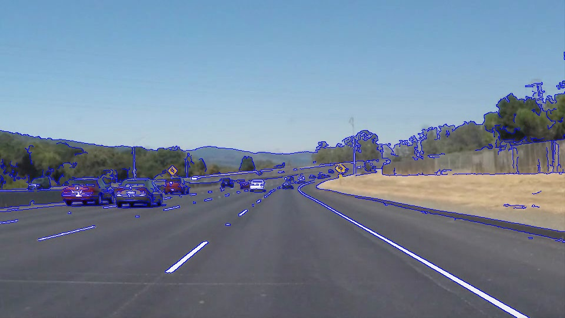

# **Finding Lane Lines on the Road WRITEUP** 

## REFLECTION

This document is the reflection of the development of the pipeline to find lane lines in a real road, in this case, in the Highway 280 of California.

This document is divided in 3 sections: the first one, is the **pipeline** whit its corresponding experiments. The second one, is the **limitations** of the pipeline. And the last one is the possible **improvements** of the pipeline.

### Pipeline
This approach consist in a sequence of steps to obtain the lane lines of a roadway driving image:

1. Transform the image to gray scale (optionally the image can be  transformed to HSV space and get two masks for yellow and white lines, but this method didn't improved the results) 

2. Gaussian smoothing and Edge detection (Canny method was used in this case)

