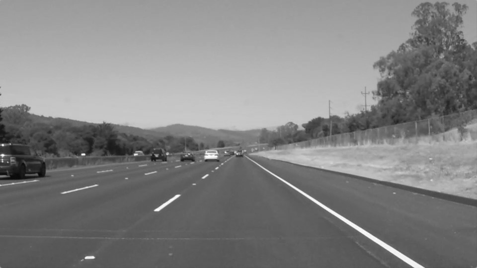
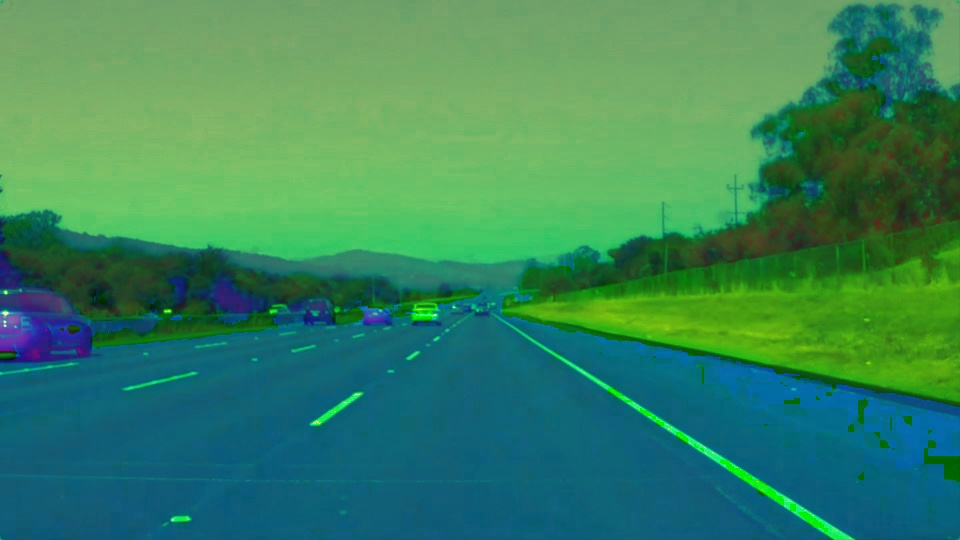

# **Finding Lane Lines on the Road WRITEUP** 

## REFLECTION

This document is the reflection of the development of the pipeline to find lane lines in a real road, in this case, in the Highway 280 of California.

This document is divided in 3 sections: the first one, is the **pipeline** whit its corresponding experiments. The second one, is the **limitations** of the pipeline. And the last one is the possible **improvements** of the pipeline.

### Pipeline
This approach consist in a sequence of steps to obtain the lane lines of a roadway driving image:

 **Step 1: GrayScale, darken, colour space and color threshold**
 1. Gray Scale, Darken and Color space

  
  
  

  
  
  

2. 

3. Gaussian smoothing and Edge detection (Canny method was used in this case)

4. Define the region of interest 

5. Apply the Hough Transform

6. Refine the lines to obtain two lines, one for each lane side

