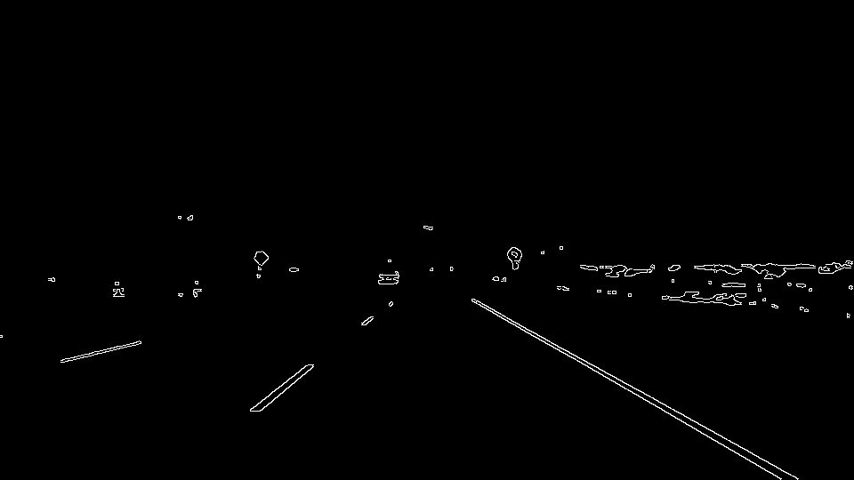

# **Finding Lane Lines on the Road WRITEUP** 

## REFLECTION

This document is the reflection of the development of the pipeline to find lane lines in a real road, in this case, in the Highway 280 of California.

This document is divided in 3 sections: the first one, is the **pipeline** whit its corresponding experiments. The second one, is the **limitations** of the pipeline. And the last one is the possible **improvements** of the pipeline.

### Pipeline
This approach consist in a sequence of steps to obtain the lane lines of a roadway driving image:

 **Step 1: GrayScale, darken, colour space and color threshold**
 1. Gray Scale, Darken and Color space

  
  
  
  

  
  
  
  

 2. HLS Colour threshold and final mask

  
  
  

  
  
  

 **Step 2: Gaussian Blur and Edge Detection**

  
  

  
  
   

 **Step 3: Define region of interest**

  
  

 
 
 **Step 4: Hough Transform**

  
  

  
  

 
 
 
 
 
 
 
 
 
 
 
 
 
